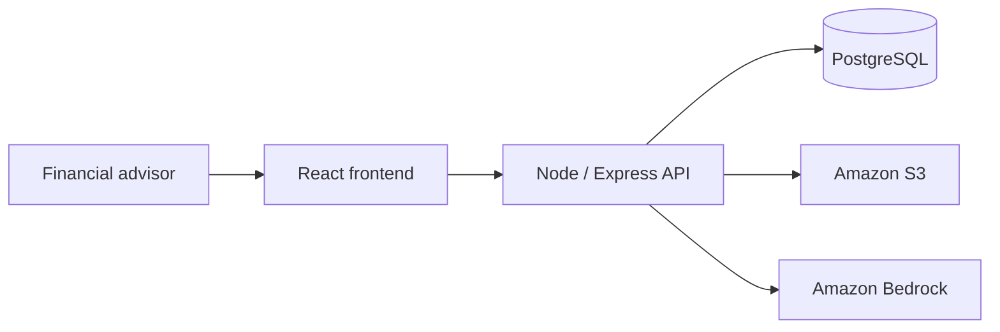

<div align="center">

# Oriented

### Advisor Orientation before the first meeting

An AI-powered onboarding workspace that helps financial advisors understand client history and prepare for their next conversation.

**React · Node.js · PostgreSQL · Amazon S3 · Amazon Bedrock**

</div>

---
Temporary Email: client@lpl.com
Temporary Password: pass123

## 🎯 Overview

When an advisor takes responsibility for an existing client, understanding the relationship requires more than reading the latest account balance. Important context lives across meeting notes, portfolio records, changing goals, and unresolved requests.

Oriented brings that information into one onboarding workflow. It helps advisors identify what changed, understand earlier commitments, and generate an AI briefing before the first meeting.

Temporary Email/Password: 

## ✨ Key Features

### 1. Advisor Dashboard

- View clients and onboarding progress in one workspace.
- Identify clients who need attention.
- Open client information and briefing entry points.

### 2. Client History and Change Detection

- Review historical goals, life events, and communication preferences.
- Identify changes in retirement targets and risk preferences.
- Bring important relationship context into meeting preparation.

### 3. Outstanding Commitments

- Surface promised follow-ups and unresolved requests.
- Review relevant due dates and responsible teams.
- Help the incoming advisor maintain continuity of service.

### 4. Portfolio Context

- Review recorded portfolio allocation changes.
- Connect portfolio history with the client's changing priorities.
- Prepare questions for the next conversation.

### 5. AI Advisor Briefing

- Generate a concise client briefing using Amazon Bedrock.
- Combine supplied client records and document context.
- Review the briefing and source information before confirming next steps.

## 🖥️ Dashboard


*Dashboard shown with synthetic demonstration data.*

## 🏗️ Architecture

| Component | Technology | Role |
| :--- | :--- | :--- |
| Frontend | React, Vite, Lucide icons | Login, advisor dashboard, and briefing display |
| Backend | Node.js, Express | Authentication and briefing requests |
| Database | PostgreSQL, Prisma | User accounts and structured data |
| Document storage | Amazon S3 | Client documents and history files |
| AI service | Amazon Bedrock | Briefing generation from supplied evidence |
| Authentication | Argon2, JWT | Password hashing and signed access tokens |

### Data Flow



1. The advisor signs in and selects a client.
2. The backend gathers client records and document context.
3. Amazon Bedrock generates a briefing from the supplied information.
4. The frontend displays the briefing for advisor review.

PostgreSQL stores database records. The backend configuration supports Supabase-hosted PostgreSQL. Amazon S3 stores documents.


## 📁 Project Structure

```text
frontend/
  src/
    App.jsx             Login and application entry point
    Dashboard.jsx       Advisor dashboard
    api/auth.js         Login API helper
  vite.config.js        Local backend proxy

server/
  src/                  API routes, services, and configuration
  prisma/               Database schema and migrations
  data/clients.json     Synthetic client histories
  .env.example          Backend environment example
```

## 🎬 Demo Walkthrough

1. Sign in to the advisor workspace.
2. Select a client from the dashboard.
3. Review historical context and open commitments.
4. Generate an AI briefing.
5. Review the information and prepare the next conversation.

### Example: Sarah Lee

*Synthetic client history with an illustrative briefing.*

| Finding | Meeting preparation |
| :--- | :--- |
| Retirement target changed from 2034 to 2031 | Confirm the updated timeline |
| Risk preference changed from moderate to conservative | Review the current preference |
| Equity allocation moved from 75% in March 2022 to 58% in January 2025 | Discuss the recorded portfolio changes |
| Beneficiary follow-up remains open | Confirm the outstanding request |
| Healthcare retirement-budget update is pending | Include it in the conversation |

**Suggested question:** “Does your 2031 retirement target still reflect your plans?”


## 🔐 Data and Credentials

- Keep `.env`, database passwords, JWT secrets, and AWS credentials out of GitHub.
- Keep service credentials in the backend.
- Use fictional client information for demonstrations.
- Advisors review source information and confirm the next action.

## 👥 Team

- Varun Suresh
- Sai Vangapandu
- Soumith Vallapalli
- Sule Kalkan

---

<div align="center">

**Oriented**

Advisor Orientation before the first meeting.

</div>
